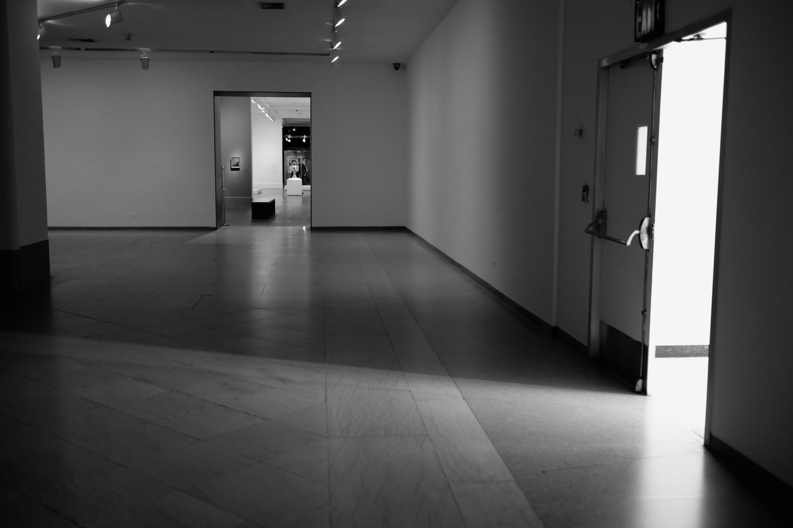

100 Words

I'm inspired by [this blog post](https://medium.com/@kadavy/100-words-about-100-words-4b902d946265#.ob9xdlczw) by [David Kadavy](https://medium.com/@kadavy) about trying to write 100 words every day. It's a reasonable, realistic goal, which might produce some interesting thoughts.

So, this is the first one, on a Tuesday, which feels very much like a Monday. It's not about anything in particular beyond the idea of making small life changes, little resolutions, or new habits. 

I'm gonna keep to my goal of writing something a little more lengthy each Sunday, supplemented throughout the week by these 100 words at a time.

To add a little spice, I'll include a photo too!